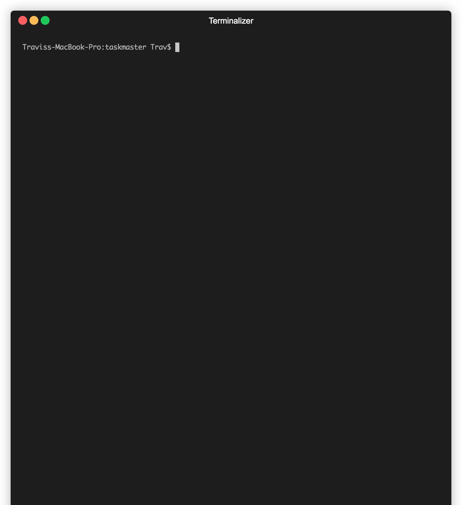

[![Contributors][contributors-shield]][contributors-url]
[![Forks][forks-shield]][forks-url]
[![Stargazers][stars-shield]][stars-url]
[![Issues][issues-shield]][issues-url]
[![MIT License][license-shield]][license-url]
[![LinkedIn][linkedin-shield]][linkedin-url]


<!-- TABLE OF CONTENTS -->
<details open="open">
  <summary>Table of Contents</summary>
  <ol>
    <li>
      <a href="#about-the-project">About The Project</a>
      <ul>
        <li><a href="#built-with">Built With</a></li>
      </ul>
    </li>
    <li>
      <a href="#getting-started">Getting Started</a>
      <ul>
        <li><a href="#prerequisites">Prerequisites</a></li>
        <li><a href="#installation">Installation</a></li>
      </ul>
    </li>
    <li><a href="#usage">Usage</a></li>
    <li><a href="#roadmap">Roadmap</a></li>
    <li><a href="#test">Test</a></li>
    <li><a href="#contributing">Contributing</a></li>
    <li><a href="#license">License</a></li>
    <li><a href="#contact">Contact</a></li>
    <li><a href="#acknowledgements">Acknowledgements</a></li>
  </ol>
</details>


<!-- ABOUT THE PROJECT -->
## About The Project



Taskmaster is a lightweight process control manager written in Golang, similar to [systemd](https://www.freedesktop.org/wiki/Software/systemd/) or [supervisor](http://supervisord.org/)

### Built With

* [Golang](https://golang.org)


<!-- GETTING STARTED -->
## Getting Started

### Prerequisites

The only prerequisite dependency is Golang.

### Installation

1. Clone the repo
   ```sh
   git clone https://github.com/travmatth/taskmaster.git
   ```
2. Install Go packages
   ```sh
   go install
   ```
3. Compile program:
  ```sh
  go build -o taskmaster Main.go
  ```


<!-- USAGE EXAMPLES -->
## Usage

```
Usage: ./taskmaster <Config_File> <Log_File> [Log_Level]
        Config_File: Procfile you wish to run
        Log_File: Log file you wish to use
        Log_Level:  0 CRITICAL, 1 ERROR, 2 WARNING, 3 NOTICE, 4 INFO, 5 DEBUG
```

Taskmaster accepts a config file containing a list of processes to start, along with the options managing their execution and termination. Provides a simple UI to manage processes.

# Procfile:

```yml
- id: an ID to identify the process, must be unique
  command: [int] command & options to be executed
  instances: [int] number of instances to launch
  atLaunch: [bool=true] [default=true] whether to launch at startup
  restartPolicy: [always|unexpected|never] whether to restart instances always|never|unexpected exit
  expectedExit: [int] the expected exit code
  startCheckup: [int] time in seconds to wait before checking if the process started successfully
  maxRestarts: [int] the maximum number of times to attempt restart if failed
  stopSignal: [string] signal to be sent to process to kill (name in `man signal`)
  stopTimeout: [int] time in seconds to wait after sending stop signal before manually killing the process
  redirections:
    stdin: [string] file to redirect stdin
    stdout: [string] file to redirect stdout
    stderr: [string] file to redirect stderr
  envVars: [string] "name=val name2=val2" variables to provide to the process environment
  workingDir: [string] a path to set as the current working directory
  umask: [int] umask to set the process permissions
- id: ID of next process to run
```

# UI Commands

```
ps:         List current jobs being managed
logs:       display jobs logs
clear:      clear the screen
start [id]: start given job
stop [id]:  stop given job
startAll:   start all jobs
stopAll:    stop all jobs
reload:     reload the configuration file
exit:       stop all jobs and exit taskmaster
```


<!-- ROADMAP -->
## Roadmap

See the [open issues](https://github.com/travmatth/taskmaster/issues) for a list of proposed features (and known issues).


<!-- TEST -->
## Test

```sh
go test taskmaster_test.go
```

<!-- CONTRIBUTING -->
## Contributing

Contributions are what make the open source community such an amazing place to be learn, inspire, and create. Any contributions you make are **greatly appreciated**.

1. Fork the Project
2. Create your Feature Branch (`git checkout -b feature/AmazingFeature`)
3. Commit your Changes (`git commit -m 'Add some AmazingFeature'`)
4. Push to the Branch (`git push origin feature/AmazingFeature`)
5. Open a Pull Request


<!-- LICENSE -->
## License

Distributed under the MIT License. See `LICENSE` for more information.


<!-- CONTACT -->
## Contact

Travis Matthews

Project Link: [https://github.com/travmatth/taskmaster](https://github.com/travmatth/taskmaster)


<!-- ACKNOWLEDGEMENTS -->
## Acknowledgements
* [Img Shields](https://shields.io)
* [Choose an Open Source License](https://choosealicense.com)


<!-- MARKDOWN LINKS & IMAGES -->
<!-- https://www.markdownguide.org/basic-syntax/#reference-style-links -->
[contributors-shield]: https://img.shields.io/github/contributors/travmatth/taskmaster.svg?style=for-the-badge
[contributors-url]: https://github.com/travmatth/taskmaster/graphs/contributors
[forks-shield]: https://img.shields.io/github/forks/travmatth/taskmaster.svg?style=for-the-badge
[forks-url]: https://github.com/travmatth/taskmaster/network/members
[stars-shield]: https://img.shields.io/github/stars/travmatth/taskmaster.svg?style=for-the-badge
[stars-url]: https://github.com/travmatth/taskmaster/stargazers
[issues-shield]: https://img.shields.io/github/issues/travmatth/taskmaster.svg?style=for-the-badge
[issues-url]: https://github.com/travmatth/taskmaster/issues
[license-shield]: https://img.shields.io/github/license/travmatth/taskmaster.svg?style=for-the-badge
[license-url]: https://github.com/travmatth/taskmaster/blob/master/LICENSE.txt
[linkedin-shield]: https://img.shields.io/badge/-LinkedIn-black.svg?style=for-the-badge&logo=linkedin&colorB=555
[linkedin-url]: https://www.linkedin.com/in/travis-matthews-885228141/
